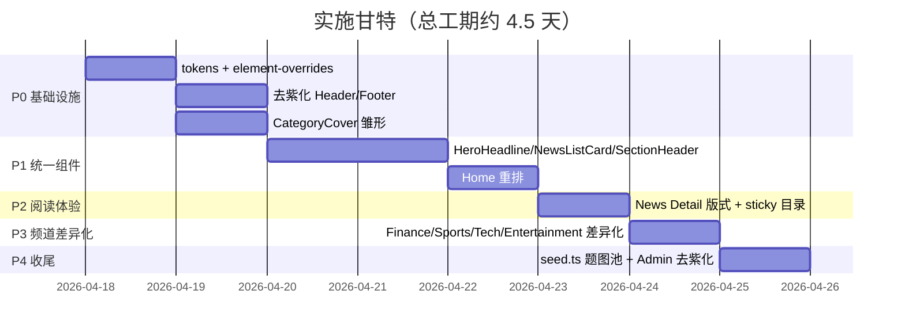

# 门户网站前端优化方案

> 版本：v1.0 · 2026-04-17
> 设计基调：**modern-gov**（现代政务风）
> 配图策略：**hybrid**（Unsplash 精选大图 + SVG 渐变缩略图）
> 关联技能：`.cursor/skills/frontend-design`、`.cursor/skills/ui-ux-pro-max`

---

## 目录

1. [背景与现状诊断](#一背景与现状诊断)
2. [方案交付物与边界](#二方案交付物与边界)
3. [设计系统令牌（Design Tokens）](#三设计系统令牌design-tokens)
4. [配图治理：Hybrid 策略](#四配图治理hybrid-策略)
5. [分类配图映射表](#五分类配图映射表)
6. [页面级改造清单](#六页面级改造清单)
7. [统一 UI 组件清单](#七统一-ui-组件清单)
8. [信息架构与数据流](#八信息架构与数据流)
9. [性能与无障碍检查清单](#九性能与无障碍检查清单)
10. [实施路线 P0–P4](#十实施路线-p0p4)

---

## 一、背景与现状诊断

通过扫描下列核心文件得到的事实依据：

- [`portal-frontend/src/views/Home/index.vue`](../portal-frontend/src/views/Home/index.vue)
- [`portal-frontend/src/views/News/index.vue`](../portal-frontend/src/views/News/index.vue)
- [`portal-frontend/src/views/News/Detail.vue`](../portal-frontend/src/views/News/Detail.vue)
- [`portal-frontend/src/views/Entertainment/index.vue`](../portal-frontend/src/views/Entertainment/index.vue)
- [`portal-frontend/src/views/Finance/index.vue`](../portal-frontend/src/views/Finance/index.vue)
- [`portal-frontend/src/views/Sports/index.vue`](../portal-frontend/src/views/Sports/index.vue)
- [`portal-frontend/src/views/Tech/index.vue`](../portal-frontend/src/views/Tech/index.vue)
- [`portal-frontend/src/components/layout/Header.vue`](../portal-frontend/src/components/layout/Header.vue)
- [`portal-frontend/src/components/layout/Footer.vue`](../portal-frontend/src/components/layout/Footer.vue)
- [`portal-backend/prisma/seed.ts`](../portal-backend/prisma/seed.ts)

### 1.1 四类关键问题

| 维度 | 具体问题 | 触发的 UX 反模式 |
| --- | --- | --- |
| 视觉基调 | Element Plus 默认蓝 + 自定义 6 组 `linear-gradient(135deg, #667eea → #764ba2)` 紫色渐变；所有频道卡、按钮、标签颜色同质 | `ui-ux-pro-max` 反模式 "cliched purple gradient on white" |
| 配图 | 封面全部外链 `images.unsplash.com/photo-*`，裁剪参数混用（`800×450` / `1200×600`）；列表缩略图失败即空白；分类间无视觉差异 | 无统一图像层、CLS 风险、离线/弱网退化差 |
| 组件一致性 | 5 个频道页各自手写列表卡（`el-card`/自定义 div 混用），样式漂移；Header "设为首页/加入收藏" 为死链；Admin 保留紫色主题与前台割裂 | `frontend-design` "缺乏一致的 aesthetic point of view" |
| UX 细节 | 部分 `cursor:pointer` 缺失、`` 无 `alt/loading`、README 与 UI 文案里 emoji 作为图标（🎯🚀✅）、`focus-visible` 未定义 | `ui-ux-pro-max` "No emoji icons / Cursor pointer / Focus states" |

### 1.2 与技能库的对标

- `frontend-design` 要求"Commit to a BOLD aesthetic direction"，当前门户是无方向的模板堆叠。
- `ui-ux-pro-max` 要求"Use SVG icons (Heroicons/Lucide) · consistent sizing · stable hover · border visibility"，当前均未满足。

---

## 二、方案交付物与边界

**本次只交付设计方案文档**（即本文件），**不修改任何前后端代码**。代码改动需要在 P0–P4 路线获得批准后，分阶段独立提交。

- 产出文件：`docs/OPTIMIZATION_PLAN.md`（本文件）
- 不改：`portal-frontend/src/**`、`portal-backend/src/**`、`portal-backend/prisma/seed.ts`
- 下游消费者：后续实现阶段的 agent / 工程师按本文件分 P0–P4 执行

---

## 三、设计系统令牌（Design Tokens）

### 3.1 颜色（语义命名，不使用 hex 直写）

```text
/* 品牌主色：权威 · 理性 · 可信 */
--brand-navy:   #0A2540   /* 主体：Header、主按钮、一级链接、焦点蒙版 */
--brand-navy-600: #11365B /* hover 态 */
--brand-navy-900: #061A33 /* 按压态 / 深色背景 */

/* 品牌辅色：强调 · 头条 · 破题 */
--brand-red:    #C0392B   /* 头条标签、破题红线、重要 CTA */
--brand-red-600:#A33022

/* 编辑金：仅用于"精选/勋章/时间戳"（≤5% 面积） */
--brand-gold:   #C9A961
--brand-gold-600:#B3914A

/* 中性墨色阶（正文与分隔） */
--ink-900:   #0F172A   /* 大标题 */
--ink-700:   #1E293B   /* 次级标题 */
--ink-600:   #475569   /* 正文 body */
--ink-400:   #94A3B8   /* 辅助说明、时间戳 */
--ink-300:   #CBD5E1   /* 占位文字 */

/* 背景与分隔线 */
--mist-50:   #F8FAFC   /* 页面底色 */
--mist-100:  #F1F5F9   /* 卡片底色/分区块 */
--line:      #E2E8F0   /* 1px 分隔线 */
--line-strong:#CBD5E1  /* 表头/关键分隔 */

/* 语义色（仅用于状态反馈） */
--state-success: #16A34A
--state-warning: #D97706
--state-danger:  #DC2626
--state-info:    #2563EB
```

### 3.2 字体

```text
/* 三档字体，对应三类内容 */
font-display: "Noto Serif SC", "Source Han Serif SC", "Songti SC", serif;
font-body:    "Inter", "PingFang SC", "Microsoft YaHei", system-ui, sans-serif;
font-mono:    "IBM Plex Sans", "JetBrains Mono", ui-monospace, monospace;

/* 字号刻度（基于 8px 基线，pt 数值为 CSS px） */
--fs-display-1: 48px / 1.1   /* Home hero 大标题 */
--fs-display-2: 36px / 1.15  /* 频道 banner */
--fs-h1:        32px / 1.2
--fs-h2:        24px / 1.3
--fs-h3:        20px / 1.35
--fs-h4:        18px / 1.4
--fs-body:      16px / 1.7   /* 文章正文（Detail） */
--fs-list:      15px / 1.6   /* 列表标题 */
--fs-meta:      13px / 1.5   /* 元信息、时间戳 */
--fs-micro:     12px / 1.4   /* 水印、版号 */

/* 字重 */
--fw-regular: 400;
--fw-medium:  500;
--fw-bold:    700;  /* 衬线标题专用 */
```

### 3.3 间距 · 圆角 · 阴影 · 动效

```text
/* 间距（8px 基线） */
--sp-1: 4px;  --sp-2: 8px;  --sp-3: 12px; --sp-4: 16px;
--sp-5: 24px; --sp-6: 32px; --sp-7: 48px; --sp-8: 64px;

/* 圆角：整体方正，告别 12–16 */
--radius-xs: 2px;
--radius-sm: 4px;   /* 标签、输入框 */
--radius-md: 8px;   /* 卡片 */
--radius-pill: 999px; /* 仅头像/圆点 */

/* 阴影：低调克制 */
--shadow-line: 0 1px 0 var(--line);
--shadow-card: 0 8px 24px -12px rgba(10, 37, 64, 0.15);
--shadow-lift: 0 12px 32px -14px rgba(10, 37, 64, 0.22);

/* 动效：统一曲线与时长 */
--ease:      cubic-bezier(0.2, 0, 0, 1);
--dur-fast:  150ms;
--dur-base:  200ms;
--dur-slow:  240ms;
```

### 3.4 Element Plus 主题覆盖示例

> 新增 `portal-frontend/src/styles/element-overrides.scss`，放在 `main.ts` 的 `import 'element-plus/dist/index.css'` 之后：

```scss
:root {
  --el-color-primary:           #0A2540;
  --el-color-primary-light-3:   #2D4A6B;
  --el-color-primary-light-5:   #5E7A96;
  --el-color-primary-light-7:   #9BADC2;
  --el-color-primary-light-9:   #E1E8EF;
  --el-color-primary-dark-2:    #061A33;

  --el-color-danger:  #C0392B;
  --el-color-success: #16A34A;
  --el-color-warning: #D97706;
  --el-color-info:    #475569;

  --el-border-radius-base:  4px;
  --el-border-radius-small: 2px;
  --el-font-family:         var(--font-body);
}

/* 强覆盖：按钮不再使用圆角 8 */
.el-button { border-radius: var(--radius-sm); font-weight: var(--fw-medium); }

/* 标签不再用默认 info 浅灰，改走墨色阶 */
.el-tag--info { color: var(--ink-600); background: var(--mist-100); border-color: var(--line); }

/* 禁用紫色：全站搜索 `#667eea|#764ba2` 替换为 var(--brand-navy) */
```

### 3.5 落地位置（仅说明，不改码）

| 文件 | 作用 | 备注 |
| --- | --- | --- |
| `portal-frontend/src/styles/tokens.css` | 所有 CSS 变量（新建） | 在 `:root` 里导出 |
| `portal-frontend/src/styles/element-overrides.scss` | Element Plus 主题覆盖（新建） | 只覆盖变量，不写选择器内联色 |
| `portal-frontend/src/styles/typography.css` | 字体 @font-face / Google Fonts 引入（新建） | `display=swap` |
| `portal-frontend/src/main.ts` | 按"reset → tokens → element → element-overrides → typography → global"顺序 import | 关键顺序不可错 |

---

## 四、配图治理：Hybrid 策略

### 4.1 原则

1. **焦点大图**（首页 hero、详情顶图、频道 banner）：保留真实摄影图 → 用 Unsplash，但统一参数和主题词。
2. **列表 / 卡片缩略图**：不再拉远程，改为**按分类生成的 SVG 渐变 + 线性图标 + 水印**（组件 `CategoryCover.vue`）。
3. **降级链路**：所有 `` `onerror` → 指向同一个 `CategoryCover` 的 data-URL，永不空白。

### 4.2 统一的 Unsplash 参数

```text
?w=1600&h=900&fit=crop&q=80&auto=format   /* Home hero / 频道 banner */
?w=1200&h=675&fit=crop&q=80&auto=format   /* Detail 顶图 */
?w=640&h=360&fit=crop&q=75&auto=format    /* 精选列表大图（首页热点） */
```

### 4.3 `` 规约

```html

  width="640" height="360"      <!-- 或用 aspect-ratio: 16/9 的容器 -->
  @error="onImgError"           <!-- 降级到 CategoryCover -->
/>
```

### 4.4 SVG 缩略图算法（`CategoryCover.vue`）

```text
输入：{ categorySlug, title?, size = 640×360 }
输出：一个 <svg viewBox="0 0 640 360">
  1. <defs><linearGradient id="g"> 两色渐变（见 §五 映射） </linearGradient></defs>
  2. <rect fill="url(#g)" /> 全底
  3. 噪点层：<rect fill="url(#noise)" opacity="0.08" />（共用 SVG filter=turbulence）
  4. 居中线性图标（24px viewBox 等比缩放到 96px，stroke=rgba(255,255,255,.9)）
  5. 右下角 slug 大写水印：IBM Plex Sans 12px, rgba(255,255,255,.6)
  6. 左上角 4×48 朱红短标尺（仅在头条用）
```

---

## 五、分类配图映射表

8 个分类一一对齐 `portal-backend/prisma/seed.ts` 中的 `slug`，供 `seed.ts` 题图池、`CategoryCover.vue` 共同消费。

| slug | 中文 | Unsplash 主题关键词 | 题图池建议（示例 ID） | SVG 渐变（from → to） | Lucide 图标 |
| --- | --- | --- | --- | --- | --- |
| `politics` | 时政 | `government, parliament, flag, podium` | `1557804506-669a67965ba0`, `1555848962-6e79363ec58f`, `1541872703-74c5e44368f4` | `--brand-navy` → `--ink-900` | `BuildingLibrary` (`Landmark`) |
| `society` | 社会 | `city, community, crowd, street` | `1519501025264-65ba15a82390`, `1449034446853-66c86144b0ad` | `--brand-navy` → `#1E3A5F` | `Users` |
| `international` | 国际 | `world map, globe, diplomacy, UN` | `1569163139394-de4798aa62b6`, `1526778548025-fa2f459cd5c1` | `--brand-navy` → `#0E4C6E` | `Globe2` |
| `military` | 军事 | `defense, radar, aviation, ship` | `1526374965328-7f61d4dc18c5`, `1485163819542-13adeb5e0068` | `--brand-navy` → `#3B3B3B` | `Shield` |
| `finance` | 财经 | `stock chart, trading, bank, skyline` | `1590283603385-17ffb3a7f29f`, `1460925895917-afdab827c52f`, `1611974789855-9c2a0a7236a3` | `--brand-navy` → `--brand-gold` | `TrendingUp` |
| `sports` | 体育 | `stadium, athlete, olympics, field` | `1461896836934-ffe607ba8211`, `1517838277536-f5f99be501cd` | `--brand-navy` → `--brand-red` | `Trophy` |
| `entertainment` | 娱乐 | `cinema, stage, concert, spotlight` | `1485846234645-a62644f84728`, `1522869635100-9f4c5e86aa37`, `1511379938547-c1f69419868d` | `--brand-red` → `--brand-gold` | `Film` |
| `tech` | 科技 | `ai, chip, laboratory, circuit` | `1677442136019-21780ecad995`, `1635070041078-e363dbe005cb`, `1573164713714-d95e436ab8d6` | `--brand-navy` → `#0E7490` | `CpuChip` (`Cpu`) |

> 使用方式：`https://images.unsplash.com/photo-{id}?w=1600&h=900&fit=crop&q=80&auto=format`。  
> `seed.ts` 按 `article.categoryId` 从对应池中**轮询取图**，保证同分类 3–5 张不同照片；渲染层若图片加载失败，组件 fallback 至 `CategoryCover` 绘制同色系 SVG。

---

## 六、页面级改造清单

### 6.1 Home — [`Home/index.vue`](../portal-frontend/src/views/Home/index.vue)

- [ ] 删除 `channels` 数组里的 6 组 `linear-gradient(135deg, ...)` 紫色渐变，全部改为图标色块（`--brand-navy` 单色 + `--brand-red` / `--brand-gold` 1px 底边）
- [ ] 首屏改版：**左 2/3 头条大图**（`HeroHeadline`，深蓝 72% 蒙版，衬线 48px 标题）+ **右 1/3 竖排次头条 3 条**（衬线 20px + 金色 1 号/2 号/3 号）
- [ ] 轮播改为 5s 切换 + 进度条指示器（不要圆点，太弱）
- [ ] "频道导航"从 6 张带渐变底的卡片 → 一行横向文字链 + 24px Lucide 图标，分隔线 1px `--line`；移除 `channel.gradient` 字段
- [ ] "热点新闻"改用 `NewsListCard`（左 4:3 图 + 右文 + 金色圆点分类），不再用 ``
- [ ] "推荐阅读"的 `rank.top` 改为朱红衬线大字（1/2/3 用 `font-display` 32px `--brand-red`）

### 6.2 News — [`News/index.vue`](../portal-frontend/src/views/News/index.vue)

- [ ] 分类导航从 `el-tag` 改为**下划线 tab**（选中：`--brand-red` 2px bottom-border；未选中：`--ink-400`）
- [ ] 列表统一 `NewsListCard`，移除 `el-card shadow="hover"`
- [ ] 右侧热门榜数字改衬线大字，排名 1–3 使用 `--brand-red`，4+ 使用 `--ink-400`
- [ ] 分页器改为"上一页 1 2 … 10 下一页"极简样式（Element Plus `layout="prev, pager, next"`）

### 6.3 News Detail — [`News/Detail.vue`](../portal-frontend/src/views/News/Detail.vue)

- [ ] 正文最大宽度 `720px`、字号 `--fs-body` `16/1.7`、段落间距 `--sp-5`
- [ ] 顶部加**面包屑**（首页 / 新闻 / 时政 / 当前标题）
- [ ] 发布信息元条：作者头像 + 作者名 + `--fs-meta` 时间 + 浏览量 + 分类金色圆点
- [ ] 右侧浮动目录（`position:sticky; top:96px`，仅 ≥1024px 显示），从 `h2/h3` 自动抽取
- [ ] 正文首字母下沉（衬线 56px `--brand-navy`，适用首段）

### 6.4 Entertainment — [`Entertainment/index.vue`](../portal-frontend/src/views/Entertainment/index.vue)

- [ ] 从单列 grid 改为 **CSS Masonry**（`columns: 3; column-gap: 16px; break-inside: avoid`）
- [ ] 图片保留原比例（不再强制 16:9），`img { width:100%; display:block; }`
- [ ] 卡片 hover 不做位移动画，改做 `box-shadow` 轻微上浮

### 6.5 Finance / Sports / Tech — [`Finance/index.vue`](../portal-frontend/src/views/Finance/index.vue) · [`Sports/index.vue`](../portal-frontend/src/views/Sports/index.vue) · [`Tech/index.vue`](../portal-frontend/src/views/Tech/index.vue)

三个频道必须差异化，拒绝"同一个模板套三次"：

- Finance：顶部"指数条"（上证/深证/沪深 300，即使是 mock 数据也要有），主区为左文右图 + 行业排行榜
- Sports：顶部"赛事赛程"（横向卡片滚动），主区为赛事焦点 + 榜单
- Tech：顶部"前沿专题"横幅，主区双列（AI / 硬件），标签云改成关键词瀑布

### 6.6 Header — [`components/layout/Header.vue`](../portal-frontend/src/components/layout/Header.vue)

- [ ] 删除 "设为首页 / 加入收藏" 死链
- [ ] 顶部条 28px：`background: var(--brand-navy); color: #fff;` 左侧日期，右侧"指数 3213.54 ▲0.52%"占位 + 天气占位
- [ ] Logo 区：`House` 图标改为"方印"样式（4px 圆角深蓝方块 + 白色衬线"门"字；或使用 Lucide `Newspaper`）
- [ ] 主导航改下划线 hover（`--brand-red` 2px bottom），取消 `el-menu` 背景色
- [ ] 搜索框改**无边框下划线款**（`border:none; border-bottom:1px solid var(--line); border-radius:0`），placeholder `font-display` 斜体
- [ ] 热搜关键词保留，链接颜色 `--ink-600`，hover 态转 `--brand-red`

### 6.7 Footer — [`components/layout/Footer.vue`](../portal-frontend/src/components/layout/Footer.vue)

- [ ] 新增四栏布局：**关于我们 · 版权 / ICP · 友情链接 · 联系我们**
- [ ] 背景色 `--brand-navy-900`、文字 `rgba(255,255,255,0.72)`、分隔线 `rgba(255,255,255,0.08)`
- [ ] 底栏 © + ICP 备案号 + 公安备案号占位

### 6.8 Admin 后台 — [`views/Admin/*`](../portal-frontend/src/views/Admin)

- [ ] 主题色从紫 → 深海蓝 `--brand-navy`，Logo 区用同款"方印"
- [ ] 卡片 `box-shadow` 全部改为 `border: 1px solid var(--line)`，提升信息密度
- [ ] Dashboard 的四张统计卡改为"数字 32px 衬线 + 标签 `--fs-meta`"双行版式
- [ ] 表格斑马纹改为仅 hover 行 `--mist-100`，去掉奇偶行底色（更接近报刊表格）
- [ ] 登录页背景图换为同一套 `CategoryCover` 风格的深蓝渐变 SVG

---

## 七、统一 UI 组件清单

新建目录：`portal-frontend/src/components/ui/`

| 组件 | 路径 | Props | 用途 |
| --- | --- | --- | --- |
| `HeroHeadline` | `ui/HeroHeadline.vue` | `{ article, overlay?: 'dark' \| 'navy' = 'navy', ratio?: '16:9' \| '21:9' = '16:9' }` | Home 首屏、频道 banner |
| `NewsListCard` | `ui/NewsListCard.vue` | `{ article, layout?: 'row' \| 'column' = 'row', showSummary?: boolean = true }` | News/首页/各频道列表统一卡 |
| `CategoryCover` | `ui/CategoryCover.vue` | `{ slug, title?, width?, height? }` | SVG 缩略图，失败降级核心 |
| `SectionHeader` | `ui/SectionHeader.vue` | `{ title, subtitle?, moreHref?, icon? }` | 栏目头（衬线大标题 + 更多 →） |
| `MetaChip` | `ui/MetaChip.vue` | `{ category, time, views, author? }` | 替代散装 `el-tag` / `el-icon` 组合 |
| `UnderlineTabs` | `ui/UnderlineTabs.vue` | `{ items, modelValue }` | 替代 News 的 `el-tag` 分类条 |
| `IndexTicker` | `ui/IndexTicker.vue` | `{ items }` | Finance 顶部指数条 |

所有组件**不得**直接写颜色值，必须走 `var(--*)`。

---

## 八、信息架构与数据流

```mermaid
flowchart LR
    subgraph styleLayer [样式层]
        tokens[tokens.css]
        elOver[element-overrides.scss]
        typo[typography.css]
    end

    subgraph uiLayer [UI 原子层]
        hero[HeroHeadline]
        card[NewsListCard]
        cover[CategoryCover]
        secHdr[SectionHeader]
        meta[MetaChip]
        tabs[UnderlineTabs]
        ticker[IndexTicker]
    end

    subgraph pages [页面层]
        home[Home]
        news[News + Detail]
        fin[Finance]
        spo[Sports]
        ent[Entertainment]
        tech[Tech]
        admin[Admin]
    end

    subgraph imgLayer [图像层]
        unsplash[Unsplash CDN<br/>hero 大图]
        svgGen[SVG 生成器<br/>列表缩略图]
        fallback[onError 降级]
    end

    styleLayer --> uiLayer
    uiLayer --> pages
    pages --> imgLayer
    unsplash -.->|"load fail"| fallback
    fallback --> svgGen

    pages --> api[portal-backend API]
    api --> seed[seed.ts<br/>categoryId → cover pool]
    seed --> unsplash
    seed --> svgGen
```



---

## 九、性能与无障碍检查清单

### 9.1 性能

- [ ] 所有 `` 含 `loading="lazy"` `decoding="async"`；首屏 hero 显式 `fetchpriority="high"`
- [ ] 所有图片容器显式 `aspect-ratio` 或 `width/height`，避免 CLS
- [ ] Unsplash 链接强制 `q=80&auto=format`（WebP 自动协商）
- [ ] Google Fonts 使用 `display=swap`，子集化 `subset=chinese-simplified,latin`
- [ ] `element-plus` 按需导入（`unplugin-vue-components`），移除全量 CSS
- [ ] 路由级代码分割保持现状（Vite 默认），但对 Admin 模块显式 `defineAsyncComponent`
- [ ] 构建后 gzip 首屏 JS ≤ 180 KB、CSS ≤ 60 KB

### 9.2 无障碍（WCAG 2.1 AA）

- [ ] 所有可点击卡片 `cursor: pointer` + `role="link"` / `role="button"`
- [ ] 全站 `:focus-visible { outline: 2px solid var(--brand-red); outline-offset: 2px; }`
- [ ] 文字颜色对比：
  - `--ink-600` on `--mist-50` 实测 ≥ 7:1 ✅
  - `#fff` on `--brand-navy` 实测 ≥ 12:1 ✅
  - `--ink-400` 仅用于 `--fs-meta` 及以下字号（大文本 3:1）
- [ ] `prefers-reduced-motion: reduce` 下禁用 `transform/translate` 动画，仅保留透明度渐变
- [ ] 所有 `` 必须 `alt`，装饰性图片 `alt=""` 且 `role="presentation"`
- [ ] 表单控件 `<label>` 显式绑定 `for`；错误态使用文字 + 图标双重提示（不单靠颜色）
- [ ] 键盘可达：Tab 顺序与视觉顺序一致；轮播图支持 `←/→` 键
- [ ] 禁止使用 emoji 作为 UI 图标，统一 Lucide SVG（`Landmark/Users/Globe2/Shield/TrendingUp/Trophy/Film/Cpu`）

---

## 十、实施路线 P0–P4



### 10.1 分阶段文件清单

| 阶段 | 新建 | 修改 |
| --- | --- | --- |
| **P0**（0.5 天） | `styles/tokens.css`、`styles/element-overrides.scss`、`styles/typography.css`、`components/ui/CategoryCover.vue` | `main.ts`（导入顺序）、`components/layout/Header.vue`、`components/layout/Footer.vue` |
| **P1**（1.5 天） | `components/ui/HeroHeadline.vue`、`components/ui/NewsListCard.vue`、`components/ui/SectionHeader.vue`、`components/ui/MetaChip.vue` | `views/Home/index.vue` |
| **P2**（1 天） | — | `views/News/index.vue`、`views/News/Detail.vue`、`components/ui/UnderlineTabs.vue`（新建） |
| **P3**（1 天） | `components/ui/IndexTicker.vue` | `views/Finance/index.vue`、`views/Sports/index.vue`、`views/Tech/index.vue`、`views/Entertainment/index.vue` |
| **P4**（0.5 天） | — | `portal-backend/prisma/seed.ts`、`views/Admin/*.vue` |

### 10.2 验收标准

每个阶段合并前必须通过：

1. **视觉**：全局搜索 `#667eea|#764ba2|linear-gradient\(135deg` 结果为 0
2. **配图**：随机 3 个分类的列表页离线打开，缩略图仍能渲染（SVG 降级生效）
3. **a11y**：Chrome Lighthouse a11y 分 ≥ 95
4. **性能**：Home 首屏 LCP ≤ 2.5s（本地 throttled Fast 3G）
5. **一致性**：News / Finance / Sports / Tech 的列表卡 DOM 结构完全一致（都来自 `NewsListCard`）

---

## 附录 A：关键变量替换对照表

| 旧值（需删除） | 新值（对应 token） |
| --- | --- |
| `#667eea`、`#764ba2` | `var(--brand-navy)` |
| `linear-gradient(135deg, #667eea 0%, #764ba2 100%)` | 纯色 `var(--brand-navy)` 或 `linear-gradient(180deg, var(--brand-navy), var(--brand-navy-900))` |
| `#409EFF`（Element 默认蓝） | `var(--brand-navy)`（通过 element-overrides 生效） |
| `#f56c6c`、`#e6a23c` 混用 | `var(--brand-red)` / `var(--brand-gold)` 二选一 |
| `border-radius: 12px` / `16px` | `var(--radius-md)` = 8px |
| emoji（🎯🚀✅💬📈）作为 UI | Lucide SVG（`Target/Rocket/Check/MessageSquare/TrendingUp`） |
| `box-shadow: 0 2px 12px rgba(0,0,0,0.08)` | `var(--shadow-card)` |

---

## 附录 B：下一步指令

批准后进入 agent 模式，建议按此顺序逐个提交 PR/commit（每个阶段一个原子 commit）：

```text
feat(styles): add design tokens and element-overrides (P0)
refactor(layout): remove purple gradient from Header/Footer (P0)
feat(ui): add CategoryCover / HeroHeadline / NewsListCard (P1)
refactor(home): rebuild Home with new component system (P1)
refactor(news): unify News list + rebuild Detail reading layout (P2)
feat(channels): differentiate Finance/Sports/Tech/Entertainment (P3)
chore(seed+admin): align cover pool and admin theme (P4)
```

> 本文件是唯一 Source of Truth，任何实现偏离请回本文件修订后再执行。
